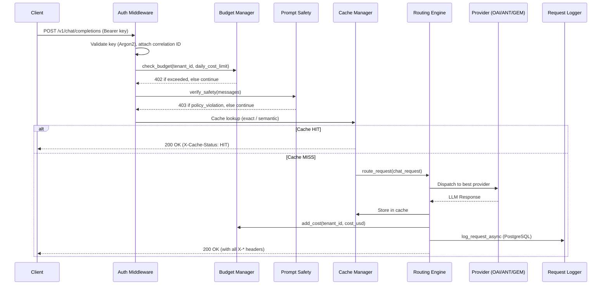
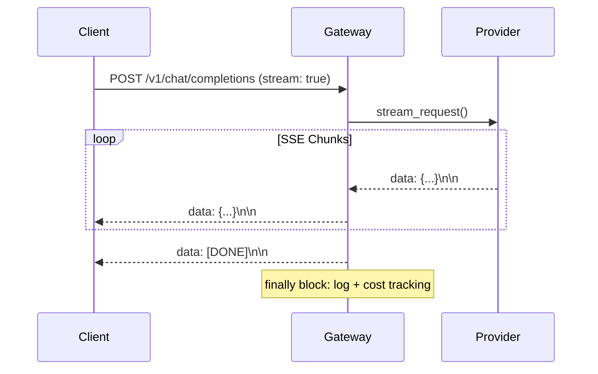
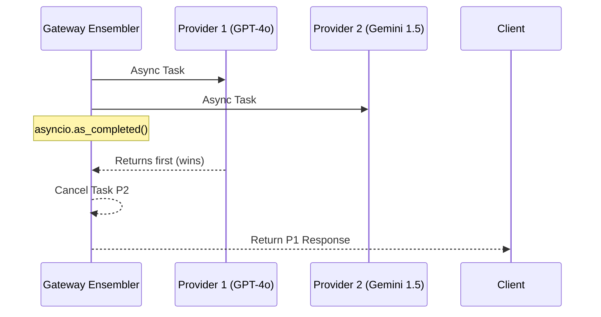

# 🏗️ Architectural Overview

The Universal LLM Gateway is designed for high-throughput, low-latency LLM orchestration with enterprise security and observability.

---

## 📐 Layered Architecture

The system is composed of five distinct layers processed in strict order per request:

1. **Ingress Layer**: FastAPI routes — standardizing OpenAI-compatible requests. Entry point: `POST /v1/chat/completions`.
2. **Guardrail Layer**: `AuthenticationMiddleware` (API key validation, rate limiting, correlation IDs) → `BudgetManager` (pre-flight 402 check) → `PromptSafetyScrubber` (403 on policy violation).
3. **Intelligence Layer**: `CacheManager` (exact-match + RediSearch semantic) → `RoutingEngine` or `ModelEnsembler`.
4. **Adapter Layer**: Provider-specific clients (OpenAI, Anthropic, Google Gemini, AWS Bedrock) with per-provider `CircuitBreaker`.
5. **Observability Layer**: `RequestLogger` (PostgreSQL persistence), `metrics` (Prometheus), OpenTelemetry tracing (configurable via `ENABLE_TRACING`).

---

## 🔄 Request Lifecycle (Sequence Diagrams)

### 1. Standard (Non-Cached) Request

### 2. Streaming Request

When `stream: true`, the router calls `stream_request()` which returns an async generator. The gateway wraps it in a `StreamingResponse` with `Content-Type: text/event-stream`. Logging and cost tracking happen in a `finally` block after the stream is fully consumed.

### 3. Model Ensembling (Race Mode)

Triggered when the request body includes `ensemble_strategy: "fastest"` and `ensemble_models: [...]`.

---

## 🛠️ Component Interactions

| Component | Technology | Role |
| :--- | :--- | :--- |
| **Redis** | `aioredis` | Rate limit buckets, exact-match cache, circuit breaker states, budget tracking |
| **RediSearch** | Redis module | Vector indexing (HNSW) for semantic similarity search |
| **PostgreSQL** | `asyncpg` + SQLAlchemy | Persistent `request_logs`, `tenants`, `api_keys` tables |
| **Notifier** | `httpx` | Fires `BUDGET_WARNING` (80%) and `BUDGET_EXCEEDED` (100%) webhooks |
| **OpenTelemetry** | `opentelemetry-sdk` | Distributed tracing (disabled via `ENABLE_TRACING=false`) |
