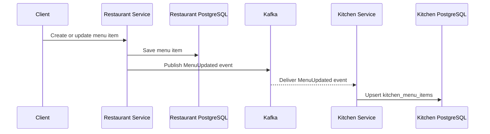
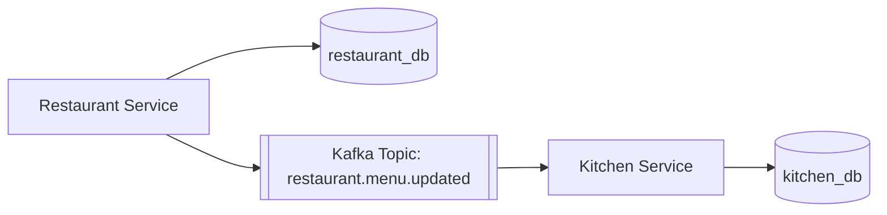
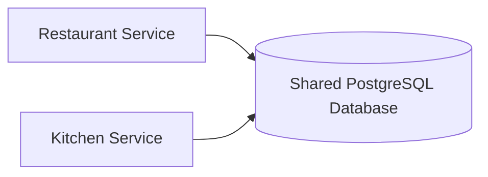
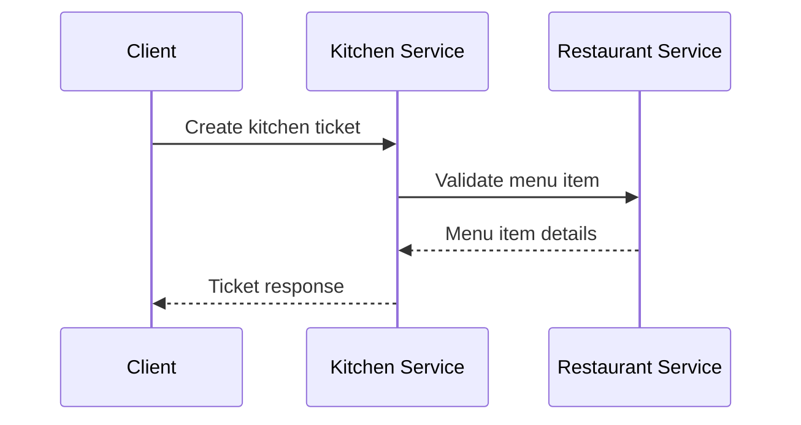
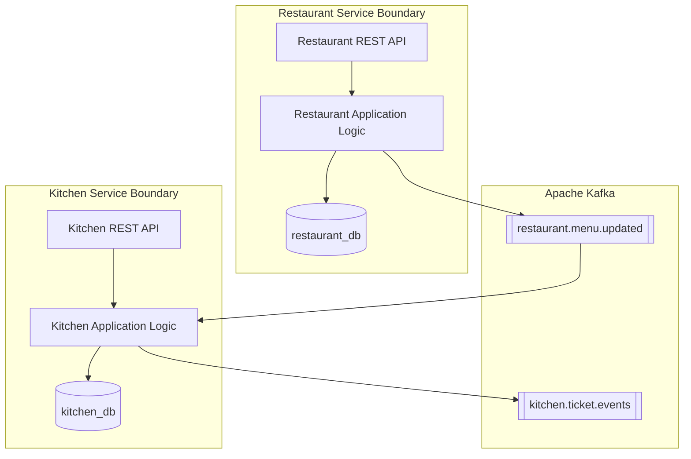
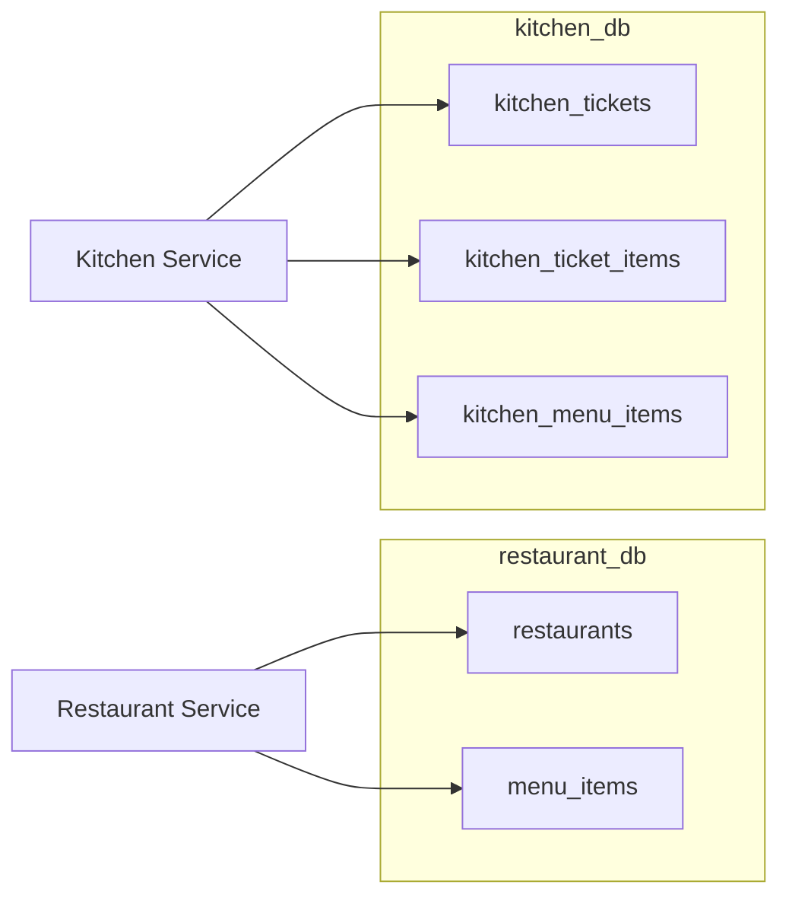
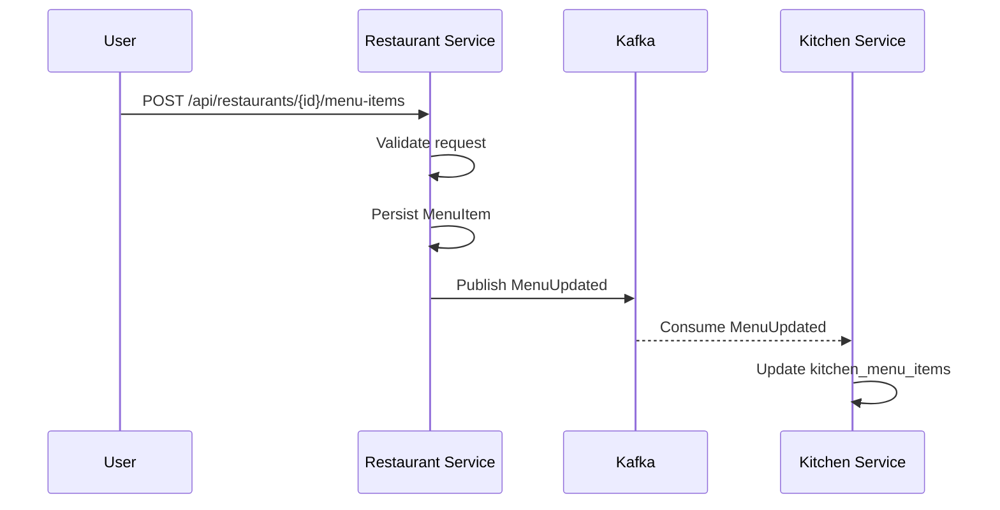
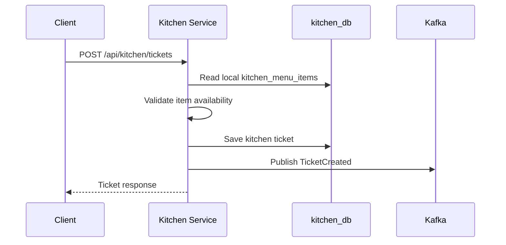

# ADR-003: Kitchen Service and Restaurant Service Architecture

## Status

Accepted

## Context

This project is a university DevOps implementation based on the FTGO (Food To Go) microservices architecture. The system contains two core services:

- **Restaurant Service**, which owns restaurant profiles and menu data.
- **Kitchen Service**, which owns kitchen tickets and preparation workflow.

The project uses Java 17, Spring Boot 3, Spring Data JPA, PostgreSQL, Apache Kafka, Docker, Kubernetes, and GitHub Actions.

The architecture follows microservice ownership rules:

- Each service owns its own PostgreSQL database.
- No service directly reads or writes another service's database.
- Services communicate using APIs and events.
- Kitchen Service maintains a local copy of menu data through Kafka event replication.

## Problem Statement

Kitchen Service needs menu information to validate kitchen tickets and display item names on tickets. However, Restaurant Service is the source of truth for restaurants and menus.

The challenge is to allow Kitchen Service to use menu data without violating microservice boundaries or creating tight coupling between services.

Specifically, the architecture must answer:

- How can Kitchen Service validate menu items without accessing Restaurant Service's database?
- How can Kitchen Service continue operating if Restaurant Service is temporarily unavailable?
- How can the system keep Restaurant and Kitchen data reasonably synchronized?
- How can the implementation demonstrate DevOps-ready microservice design using Kafka, PostgreSQL, Docker, Kubernetes, and CI/CD?

## Decision

Restaurant Service and Kitchen Service will be implemented as separate microservices with independent databases.

Restaurant Service will publish `MenuUpdated` events to Apache Kafka whenever a menu item is created, updated, or deleted. Kitchen Service will consume those events and maintain a local `kitchen_menu_items` table.

Kitchen Service will use this local menu replica when creating kitchen tickets. It will not query Restaurant Service's database and will not depend on a synchronous REST call to Restaurant Service during ticket creation.

## Why Restaurant and Kitchen Are Separate Services

Restaurant Service and Kitchen Service represent different business capabilities.

Restaurant Service is responsible for:

- Restaurant profile management
- Menu item creation
- Menu item updates
- Menu item availability
- Publishing menu change events

Kitchen Service is responsible for:

- Kitchen ticket creation
- Ticket status management
- Ticket item snapshots
- Local menu read model maintenance
- Publishing ticket lifecycle events

Keeping these capabilities separate improves service autonomy. Each service can evolve its domain model independently, scale independently, and be deployed independently.

For example, menu management traffic and kitchen ticket traffic may have different scaling needs. Restaurant menu updates may be relatively low volume, while kitchen ticket processing may be higher volume during peak ordering times.

## Why Databases Are Not Shared

The services do not share a database because shared databases create strong coupling between services.

If Kitchen Service directly queried Restaurant Service tables, then:

- Kitchen Service would depend on Restaurant Service's internal schema.
- Restaurant Service could not change its tables safely.
- Database migrations would require cross-service coordination.
- One database outage or lock issue could affect multiple services.
- Ownership of data would become unclear.

Instead:

- Restaurant Service owns `restaurants` and `menu_items`.
- Kitchen Service owns `kitchen_tickets`, `kitchen_ticket_items`, and `kitchen_menu_items`.
- `kitchen_menu_items` is a local replica, not the source of truth.

This follows the microservice rule that a service owns its data and exposes it through APIs or events, not through direct database access.

## How Event-Driven Data Replication Works

Restaurant Service publishes a `MenuUpdated` event whenever menu data changes.

The event contains:

- Event ID
- Event type
- Change type: `CREATED`, `UPDATED`, or `DELETED`
- Restaurant ID
- Menu item ID
- Name
- Description
- Price
- Availability
- Category
- Version
- Timestamp

Kitchen Service consumes the event and updates its local `kitchen_menu_items` table.

For create and update events, Kitchen Service inserts or updates the local menu item. For delete events, Kitchen Service marks the local item unavailable instead of relying on Restaurant Service's database.

This creates an event-driven read model inside Kitchen Service.

## Why Apache Kafka Is Used

Apache Kafka is used because it provides durable, asynchronous event communication between services.

Kafka is suitable for this project because:

- It decouples Restaurant Service from Kitchen Service.
- Restaurant Service does not need to know which services consume menu events.
- Kitchen Service can process events independently.
- Events are durable and can be replayed by consumers.
- Kafka supports scalable consumer groups.
- Kafka is widely used in production microservice architectures.

In this architecture, Kafka acts as the event backbone for data replication and workflow events.

## Advantages and Disadvantages of Eventual Consistency

### Advantages

Eventual consistency provides several benefits:

- Services remain loosely coupled.
- Kitchen Service does not need Restaurant Service to be online during ticket creation.
- Restaurant Service can publish events and continue operating.
- Kitchen Service can maintain optimized local data for its own use case.
- The system is more resilient to temporary service failures.

### Disadvantages

Eventual consistency also introduces tradeoffs:

- Kitchen Service may briefly have stale menu data.
- A menu update may not appear in Kitchen Service immediately.
- The system must handle duplicate or out-of-order events.
- Debugging event flows is more complex than debugging direct REST calls.
- Consumers need careful error handling and observability.

For this project, the tradeoff is acceptable because menu data does not require strict immediate consistency for every read. Kitchen Service can tolerate short replication delays while preserving service autonomy.

## Alternatives Considered

### Alternative 1: Shared Database

One option was to allow Kitchen Service to read the Restaurant Service database directly.

This was rejected because it violates microservice data ownership. It would tightly couple Kitchen Service to Restaurant Service's schema and make independent deployment harder.

This approach is simpler initially, but it weakens service boundaries and is not appropriate for a microservice architecture.

### Alternative 2: Synchronous REST Calls

Another option was for Kitchen Service to call Restaurant Service over REST whenever it needed menu data.

This was rejected as the primary approach because it creates runtime coupling. If Restaurant Service is unavailable or slow, Kitchen ticket creation may fail or become slow.

REST calls are useful for external APIs and direct user requests, but they are not ideal for Kitchen Service's menu validation dependency.

## Consequences

This decision has the following consequences:

- Restaurant Service becomes the source of truth for menu data.
- Kitchen Service maintains a local menu replica.
- Kafka must be available for menu replication.
- The system must tolerate eventual consistency.
- Events must include enough information for consumers to update local state.
- Kitchen Service must handle missing or unavailable menu items safely.
- Service deployment requires PostgreSQL and Kafka infrastructure.

The architecture also supports future services. For example, Order Service, Delivery Service, and Notification Service could consume Kitchen ticket events without requiring changes to Kitchen Service.

## Architecture Diagrams

### Service Boundary Diagram

### Database Ownership Diagram

### End-to-End Menu Replication Flow

### Kitchen Ticket Creation Flow

## Conclusion

The selected architecture separates Restaurant Service and Kitchen Service according to business capability and data ownership. Restaurant Service owns restaurant and menu data, while Kitchen Service owns kitchen tickets and maintains a local menu replica.

Kafka-based event-driven replication avoids shared database access and reduces runtime coupling between services. The architecture accepts eventual consistency as a tradeoff in exchange for better service autonomy, scalability, and resilience.

This decision supports the goals of the FTGO DevOps project by demonstrating practical microservice boundaries, asynchronous communication, independent databases, containerization, Kubernetes deployment, and CI/CD readiness.
